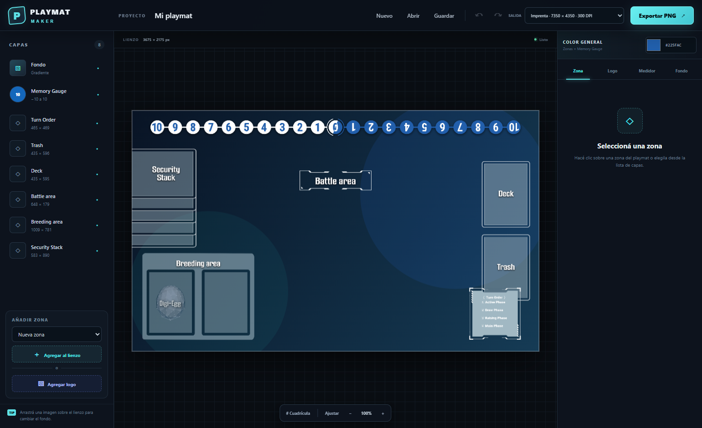
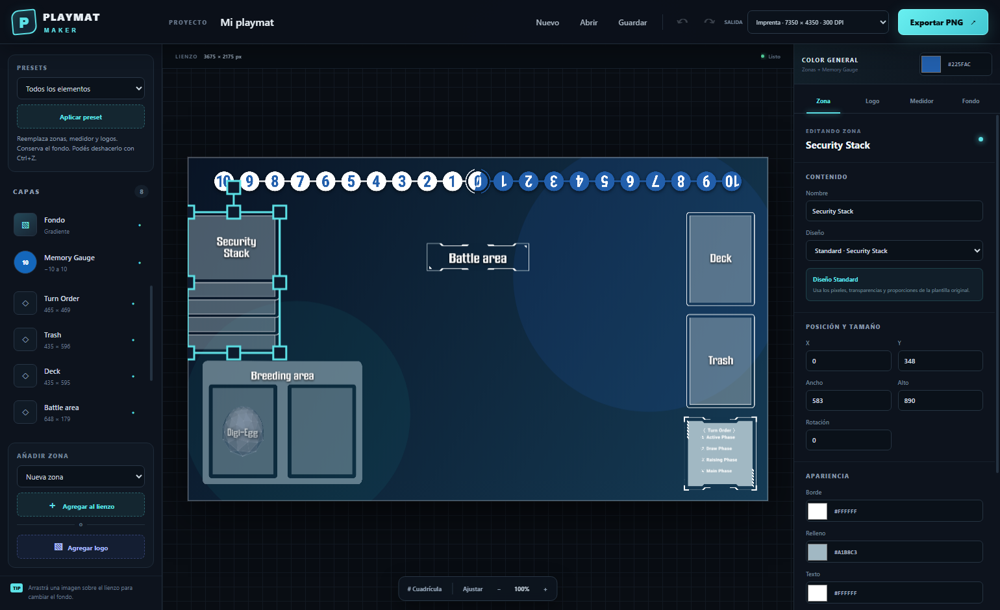
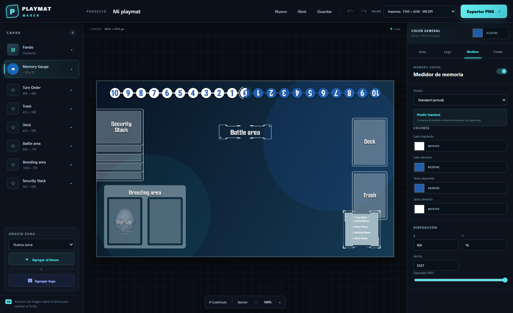

# Playmat Maker

Editor de escritorio para diseñar playmats personalizados de **Digimon Card Game**. Trabaja sobre el tamaño original de la plantilla —**3675 × 2175 px**— y puede exportar directamente a resolución de imprenta.



## Descargar y ejecutar

1. Abrí la sección [Releases](https://github.com/SantiVaras/playmat-maker/releases).
2. Descargá `Playmat-Maker-1.3.0-Portable.exe` desde la versión más reciente.
3. Ejecutá el archivo. Es portable: no requiere instalación, Node.js ni npm.

> Windows puede mostrar una advertencia de SmartScreen si el ejecutable no está firmado con un certificado reconocido. Verificá que el archivo provenga de este repositorio y compará su SHA-256 con `SHA256SUMS.txt` incluido en el release.

## Guía de uso

### 1. Elegir el fondo

Arrastrá una imagen sobre el lienzo o seleccioná la capa **Fondo** para cargarla. Desde la pestaña **Fondo** podés reencuadrarla, ajustar escala y posición, aplicar opacidad o mantener el gradiente predeterminado.

### 2. Editar las zonas

Seleccioná una zona en el lienzo o en la lista **Capas**. Los controles laterales permiten:

- cambiar nombre y diseño;
- mover, redimensionar y rotar;
- modificar borde, relleno, texto y opacidad;
- ocultar o bloquear la zona;
- duplicarla y cambiar su orden de apilado.

Los presets **Security Stack**, **Breeding area**, **Battle area**, **Deck**, **Trash** y **Turn Order** conservan las proporciones de la plantilla original. También podés agregar una zona personalizada.



### 3. Personalizar el Memory Gauge

Elegí **Memory Gauge** en la lista de capas y abrí la pestaña **Medidor**. Podés seleccionar el diseño, cambiar los colores de ambos lados y sus textos, ajustar posición, ancho y opacidad sin perder la geometría del medidor.



### 4. Agregar logos

Usá **Agregar logo** para incorporar imágenes PNG o WebP. Cada logo se puede mover, escalar, rotar, duplicar, ocultar y bloquear de manera independiente.

### 5. Guardar y volver a editar

Presioná **Guardar** para crear un archivo `.playmat`. Luego podés usar **Abrir** para recuperar el proyecto con sus capas y ajustes.

### 6. Exportar

Elegí la salida desde la barra superior y presioná **Exportar PNG**:

- **Estándar:** 3675 × 2175 px, 150 DPI.
- **Imprenta:** 7350 × 4350 px, 300 DPI.

## Atajos de teclado

| Atajo | Acción |
| --- | --- |
| `Ctrl+S` | Guardar el proyecto |
| `Ctrl+Z` | Deshacer |
| `Ctrl+Shift+Z` | Rehacer |
| `Ctrl+D` | Duplicar la selección |
| `Delete` | Eliminar la selección |
| Flechas | Mover la zona seleccionada |

## Desarrollo

Requiere Node.js 20 o superior.

```bash
npm install
npm run dev
```

`npm run dev` inicia Vite y abre la aplicación en Electron.

Para generar el ejecutable portable:

```bash
npm run build
```

El artefacto se crea en `release/Playmat-Maker-1.3.0-Portable.exe`.

### Organización del código

Consultá la [guía de estructura y mantenimiento](docs/architecture.md) para ubicar componentes, lógica del editor, estilos y operaciones de Electron.

Para comprobar los flujos principales en una ventana oculta de Electron:

```bash
npm run test:smoke
```
